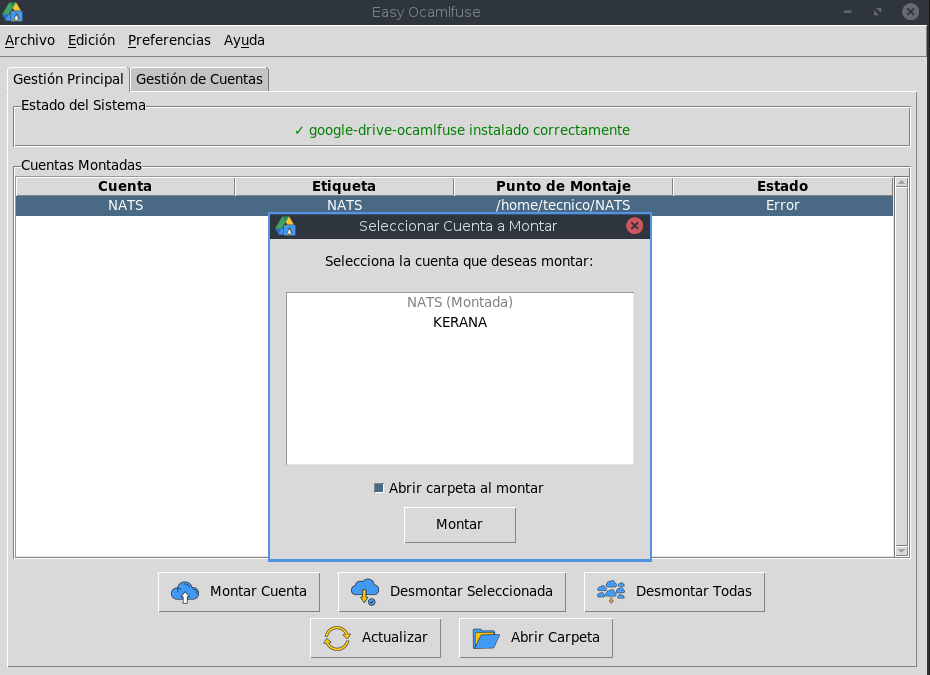
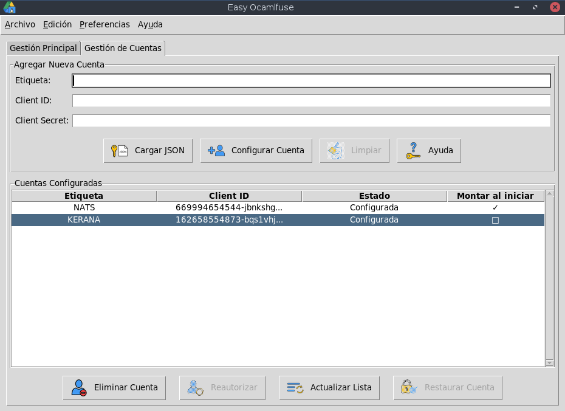
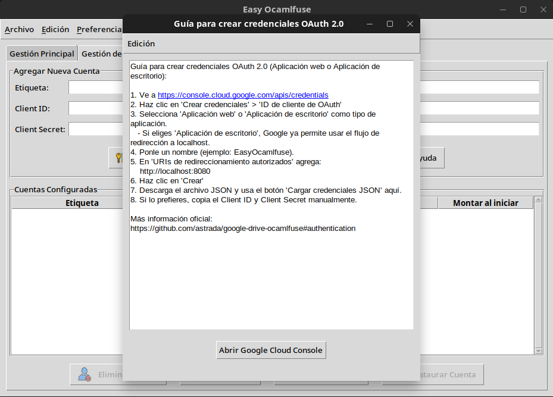

# Easy Ocamlfuse - Gestor Gráfico para google-drive-ocamlfuse
[](https://ayalarol.github.io/easy-ocamlfuse-landing/)

<p align="center">
  
  <br><em>Gestión principal</em>
</p>

<p align="center">
  
  <br><em>Gestión cuentas</em>
</p>

<p align="center">
  
  <br><em>Guía de credenciales</em>
</p>

**Easy Ocamlfuse** es una aplicación de escritorio con interfaz gráfica (GUI) para gestionar [google-drive-ocamlfuse](https://github.com/astrada/google-drive-ocamlfuse), facilitando el montaje y la administración de tus cuentas de Google Drive en sistemas Linux.

La aplicación está desarrollada en Python con Tkinter y es compatible para agregar multiples idiomas (español e inglés por defecto).

[](https://github.com/ayalarol/Easy-ocamlfuse/releases/tag/v1.0.0)

---

## ✨ Características Principales

- **Gestión de Múltiples Cuentas**: Añade, configura y elimina múltiples cuentas de Google Drive
- **Montaje y Desmontaje Sencillo**: Monta y desmonta tus unidades con un solo clic
- **Automontaje al Inicio**: Configura tus cuentas para que se monten automáticamente al iniciar la aplicación
- **Bandeja del Sistema**: Se integra con la bandeja del sistema para un acceso rápido y gestión en segundo plano
- **Internacionalización**: Soporte para múltiples idiomas (español e inglés incluidos)
- **Detección Automática**: Detecta instalaciones existentes de `google-drive-ocamlfuse` y las importa
- **Asistente de Instalación**: Si `google-drive-ocamlfuse` no está instalado, la aplicación te guiará para instalarlo automáticamente
- **Restauración de Cuentas**: Permite restaurar cuentas eliminadas previamente

---

## 📋 Requisitos

### Dependencias del Sistema
Asegúrate de tener las siguientes dependencias del sistema instaladas. Estas son necesarias para el correcto funcionamiento de la interfaz gráfica, el icono de la bandeja del sistema y las notificaciones.

- **Python 3.5** o superior (el paquete `.deb` requiere `python3 (>= 3.5)`)
- **Tkinter**: Generalmente se instala con `python3-tk`
- **gettext**: Para la internacionalización
- **Librerías D-Bus**: Necesarias para la comunicación del sistema
- **Python GObject Introspection**: Para la integración con el escritorio y el icono de la bandeja (`python3-gi`)
- **AppIndicator**: Para el icono de la bandeja del sistema en entornos de escritorio compatibles (`gir1.2-appindicator3-0.1`)

En distribuciones basadas en Debian/Ubuntu (versiones como Ubuntu 16.04+ o Debian 9+), puedes instalar la mayoría con:

```bash
sudo apt update
sudo apt install python3-tk gettext python3-pil python3-dbus libdbus-glib-1-2 python3-gi gir1.2-appindicator3-0.1 python3-pip
```
### Dependencias de Python

Las dependencias de Python se empaquetan directamente dentro del paquete `.deb` para asegurar la compatibilidad y evitar conflictos. Sin embargo, si estás ejecutando desde el código fuente o tienes problemas con la versión de `Pillow` en sistemas más antiguos (como Ubuntu 16.04), puedes forzar una actualización o instalación específica.

Se recomienda el uso de un entorno virtual para evitar conflictos con otras dependencias del sistema.

**Crear y activar un entorno virtual:**

```bash
python3 -m venv venv
source venv/bin/activate
```

**Instalar las dependencias usando pip:**

```bash
pip install -r requirements.txt
```

O bien, si prefieres instalarlas manualmente:

```bash
pip install notify2 pillow pystray requests cryptography
```
**Nota sobre Pillow en Ubuntu 16.04:** En algunas versiones antiguas de Ubuntu (como 16.04), `Pillow` podría requerir una versión específica para que `ImageTk` funcione correctamente. Si experimentas problemas con `ImageTk` después de instalar las dependencias, puedes intentar actualizar `Pillow` con el siguiente comando:

```bash
pip3 install --upgrade Pillow
```
Esto debería actualizar `Pillow` a una versión compatible que incluya el módulo `ImageTk` necesario.

---

## 🚀 Instalación

Puedes instalar Easy Ocamlfuse de varias maneras:

### Desde paquete .deb (Recomendado)

  **Instala el paquete .deb:**
``` bash
       sudo apt install ./easy-ocamlfuse_1.0.0_all.deb
```
     
**Nota:** Si la bandeja del sistema o las notificaciones no funcionan, consulta la sección "Dependencias del Sistema" para instalar `pystray` y `notify2` `Pillow` con `pip` si no se instalaron automáticamente. Si la aplicación se ejecuta pero no carga los iconos correctamente (suele ocurrir cuando pillow no esta como estándar en los repositorios mas antiguos) prueba actualizando pillow con : 

```bash
  pip3 install --upgrade Pillow

```

### Desde el código fuente

1.  **Clona el repositorio:**

    ```bash
    git clone https://github.com/ayalarol/Easy-ocamlfuse.git
    cd Easy-ocamlfuse
    ```

2.  **(Opcional pero recomendado) Crea y activa un entorno virtual:**

    ```bash
    python3 -m venv venv
    source venv/bin/activate
    ```

3.  **Instala las dependencias de Python:**

    ```bash
    pip install -r requirements.txt
    ```

4.  **Ejecuta la aplicación:**

    Desde el directorio raíz del proyecto:

    ```bash
    python3 main.py
    ```

### Instalación del Binario (para Releases)

Si has descargado un binario precompilado (por ejemplo, desde la sección de "Releases" de GitHub) 
y deseas instalarlo directamente en tu sistema sin usar los paquetes `.deb` o el código fuente, puedes usar el script `install_binary.sh`.

1.  **Descarga el binario** (ej. `easy-ocamlfuse-newDristos`) para versiones mas recientes y (ej. `easy-ocamlfuse-oldDristos`) para versiones mas antiguas  y el script `install_binary.sh`(viene incluido en el comprimido) en el mismo directorio.
2.  **Dale permisos de ejecución** al script:
    ```bash
    chmod +x install_binary.sh
    ```
3.  **Ejecuta el script con `sudo`**:
    ```bash
    sudo ./install_binary.sh
    ```
    Este script moverá el binario a `/usr/local/bin`, creará un archivo `.desktop` para el menú de aplicaciones y gestionará los iconos.
    **Para desinstalar**:
    ```bash
    sudo ./uninstall_binary.sh
    ```
---

## 📖 Uso Básico

### 1. Añadir una Cuenta

1.  Ve a la pestaña **"Gestión de Cuentas"**
2.  Para obtener tus credenciales de Google, haz clic en el botón **"Ayuda"**, que te guiará en el proceso de creación de un ID de Cliente y Secreto de Cliente en Google Cloud Console
3.  Puedes cargar las credenciales desde el archivo `client_secrets.json` descargado usando el botón **"Cargar JSON"** o pegarlas manualmente
4.  Asigna una **Etiqueta** única a tu cuenta (ej. "Personal", "Trabajo")
5.  Haz clic en **"Configurar Cuenta"**. Se abrirá una ventana en tu navegador para que autorices el acceso a tu cuenta de Google

### 2. Montar una Cuenta

1.  Ve a la pestaña **"Gestión Principal"**
2.  Haz clic en **"Montar Cuenta"**
3.  Selecciona la cuenta que deseas montar de la lista
4.  La unidad se montará en tu directorio HOME en una carpeta con el mismo nombre que la etiqueta

### 3. Gestión desde la Bandeja del Sistema

La aplicación se minimizará a la bandeja del sistema al cerrar la ventana.

Desde el icono de la bandeja, puedes:

-   Mostrar la ventana principal
-   Desmontar todas las unidades
-   Salir de la aplicación

---

## 🌍 Internacionalización (i18n)

El proyecto utiliza `gettext` para las traducciones. Los archivos de idioma se encuentran en `ocamlfuse_manager_gui/locale`.

### Para actualizar o añadir un nuevo idioma:

1.  **Genera el archivo .pot (plantilla):**

    ```bash
    cd ocamlfuse_manager_gui
    xgettext --from-code=UTF-8 --language=Python --keyword=_ --output=locale/ocamlfuse_manager.pot --files-from=locale/POTFILES.in
    ```

2.  **Crea o actualiza el archivo .po para tu idioma** (ej. `fr` para francés):

    ```bash
    # Para crear uno nuevo:
    msginit -l fr -o locale/fr/LC_MESSAGES/ocamlfuse_manager.po -i locale/ocamlfuse_manager.pot

    # Para actualizar uno existente:
    msgmerge -U locale/fr/LC_MESSAGES/ocamlfuse_manager.po locale/ocamlfuse_manager.pot
    ```

3.  **Traduce los textos** en el archivo `.po`

4.  **Compila el archivo .mo:**

    ```bash
    msgfmt locale/fr/LC_MESSAGES/ocamlfuse_manager.po -o locale/fr/LC_MESSAGES/ocamlfuse_manager.mo
    ```

---

## 🤝 Contribuciones

¡Las contribuciones son bienvenidas! Si tienes ideas para mejoras, encuentras errores o quieres añadir nuevas funcionalidades, no dudes en:

-   Abrir un **issue** para reportar problemas o sugerir mejoras
-   Ayudar con las traducciones a otros idiomas

---

## 📜 Licencia

Este proyecto está bajo la **Licencia GPL**. Consulta el archivo [LICENSE.txt](LICENSE.txt) para más detalles.

---

## ⭐ Agradecimientos

Si este proyecto te ha sido útil, considera apoyar su desarrollo:

[](https://github.com/ayalarol/Easy-ocamlfuse/stargazers)
[](https://www.paypal.com/donate/?hosted_button_id=N2M3P5A24QKF4)

-   ⭐ **Dale una estrella** al proyecto en GitHub
-   💰 **Apoya con una donación** a través de PayPal

---

<p align="center">
  Desarrollado con ❤️ por <a href="https://github.com/ayalarol">ayalarol</a>
</p>
